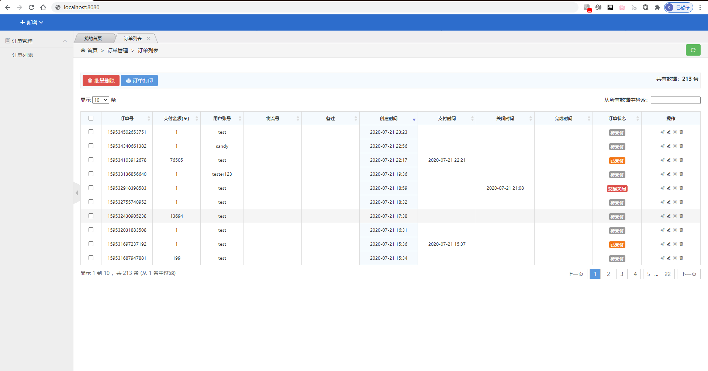

# 2020-7-21 实训日志

## 赵卓成

- ##### 继续完善商品页面

- ##### 和其他成员的页面进行协作调整

## 杨雷

完善商品管理模块，解决了数据库连接使用异常的问题。

完善前端页面，尝试与其他成员的模块对接整合。

## 贾一鸣

### 今日完成部分：

登录注册界面

购物界面

## 马恩沛

### 今天做的部分：

#### 订单模块

- 显示订单

#### 购物车模块

- 添加商品
- 移除商品
- 清空购物车

#2017/7/20 daily record 
##by 柴斌峰

#####商品页面
		<body>
	<header class="navbar-wrapper">
	    

	        
  
	            
	            <a aria-hidden="false" class="nav-toggle Hui-iconfont visible-xs" href="javascript:;"></a>
	            <nav class="nav navbar-nav">
	                <ul class="cl">
	                    <li class="dropDown dropDown_hover"><a href="javascript:;" class="dropDown_A"><i class="Hui-iconfont"></i> 新增 <i class="Hui-iconfont"></i></a>
	                        <ul class="dropDown-menu menu radius box-shadow">
	                            <li><a href="javascript:;" onclick="product_add('添加商品','product-add')"><i class="Hui-iconfont"></i> 商品</a></li>
	                            <li><a href="javascript:;" onclick="member_add('添加用户','member-add','','630')"><i class="Hui-iconfont"></i> 用户</a></li>
	                        </ul>
	                        </li>
	                        
	                        
	                        
	                        
	                    
	                </ul>
	            </nav>
	            
	        

	    

	</header>
	<aside class="Hui-aside">
	    

	        
	        
	
	        
	        <dl id="menu-order">
	            <dt class="selected"><i class="Hui-iconfont"></i> 订单管理<i class="Hui-iconfont menu_dropdown-arrow"></i></dt>
	            <dd style="display: block;">
	                <ul>
	                    <li><a data-href="order-list" data-title="订单列表" href="javascript:void(0)">订单列表</a></li>
	                </ul>
	            </dd>
	        </dl>
	        
	        
	        
	        
	        
	        
	    

	
	    

	        <dl id="menu-thank">
	            <dt><i class="Hui-iconfont"></i> 捐赠管理<i class="Hui-iconfont menu_dropdown-arrow"></i></dt>
	            <dd style="">
	                <ul>
	                    <li><a data-href="thanks-list" data-title="捐赠列表" href="javascript:void(0)">捐赠列表</a></li>
	                </ul>
	            </dd>
	        </dl>
	    

	</aside>
	

	<section class="Hui-article-box">
	    

	        

	            <ul id="min_title_list" class="acrossTab cl" style="width: 241px; left: 0px;">
	                <li class="">
	                    我的首页
	                    <em></em></li>
	            <li class="active">订单列表<i></i><em></em></li></ul>
	        

	        
<a id="js-tabNav-prev" class="btn radius btn-default size-S" href="javascript:;"><i class="Hui-iconfont"></i></a><a id="js-tabNav-next" class="btn radius btn-default size-S" href="javascript:;"><i class="Hui-iconfont"></i></a>

	    

	    

	        

	            

	            <iframe scrolling="yes" frameborder="0" src="welcome"></iframe>
	        

	    

<iframe frameborder="0" src="order-list"></iframe>

	</section>
	
	

	    <ul>
	        <li id="closethis">关闭当前 </li>
	        <li id="closeall">关闭全部 </li>
	    </ul>
	

	<!--_footer 作为公共模版分离出去-->
	
	
	
	 <!--/_footer 作为公共模版分离出去-->
	
	<!--请在下方写此页面业务相关的脚本-->
	
	
	
	
	

</body>

###图片

